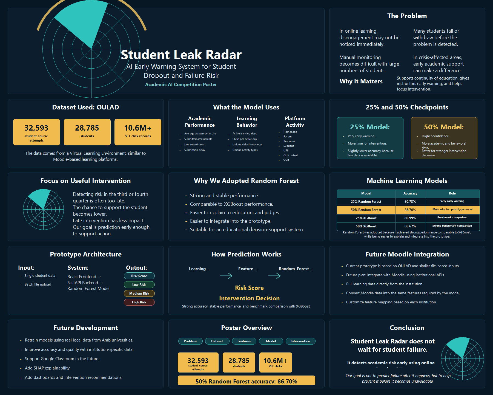

# Student Risk Radar

An AI-powered early-warning dashboard for identifying students who may be at academic risk before the final course outcome. Student Risk Radar combines machine-learning models, learning-behavior analytics, and a modern web dashboard to help academic teams prioritize timely intervention.

## Overview

Student Risk Radar is built around a practical education analytics workflow: collect student activity and assessment data, engineer early-warning features, run trained predictive models, and present risk insights through an interactive dashboard.

The system supports both individual student review and batch cohort scoring. It is designed for online, blended, and data-driven education environments where instructors need early signals before failure or withdrawal becomes final.

## Problem

Academic risk is often detected too late. By the time final grades, withdrawal records, or failed outcomes are available, the opportunity for meaningful intervention may already be gone.

Common challenges include:

- Students disengage gradually across learning platforms.
- Assessment delays and low activity patterns are difficult to monitor manually.
- Large cohorts make instructor follow-up harder.
- Raw learning data is not immediately useful without analytics and prediction.
- Institutions need earlier, clearer, and more actionable student-risk signals.

## Solution

Student Risk Radar transforms learning-platform behavior, assessment performance, submission timing, and student profile features into actionable risk predictions.

The platform provides:

- Early-warning risk prediction at key course checkpoints.
- Risk scores and risk levels for single students and uploaded cohorts.
- Dashboard views for cohort behavior, readiness, and intervention priorities.
- CSV contract guidance for clean data preparation.
- Export-ready prediction outputs for follow-up workflows.

## Features

- Single-student prediction workflow.
- Batch cohort risk scoring from CSV uploads.
- Low, Medium, and High Risk classification.
- Average risk score and risk-tier visualizations.
- Intelligence Lab for exploratory cohort analysis.
- CSV Requirements page for upload schemas and required columns.
- Model Output page for reviewing and exporting the latest predictions.
- FastAPI backend with single and batch prediction endpoints.
- Feature-engineering utility for OULAD-like raw data.
- Responsive React dashboard with a professional dark SaaS interface.

## Tech Stack

Frontend:

- React
- Vite
- React Router
- Plotly.js
- Papa Parse
- SheetJS/XLSX
- Lucide React
- Tailwind CSS plugin

Backend and Machine Learning:

- Python 3.11
- FastAPI
- Uvicorn
- NumPy
- Pandas
- scikit-learn
- XGBoost
- Joblib
- OpenPyXL

## Machine Learning Pipeline

The machine-learning workflow is based on early prediction checkpoints during course progress. The goal is to identify at-risk students before the final result by using behavioral and assessment signals available early in the course.

Pipeline stages:

1. Raw Data Collection

   The project works with OULAD-like student learning records, including student profile data, course information, VLE activity, assessment metadata, and student assessment submissions.

2. Data Cleaning and Validation

   Input tables are validated for required columns, expected table names, numeric fields, and missing values. The processing utility supports CSV folders, JSON, XLSX, SQLite databases, and feature-ready tables.

3. Feature Engineering

   Student activity and assessment records are converted into model-ready features, including average score, submitted assessments, activity days, submission delay, VLE activity counts, unique sites, activity diversity, and demographic context.

4. Early-Warning Checkpoints

   The system evaluates students at two course-progress checkpoints:

   - 25% of course progress
   - 50% of course progress

5. Model Training and Selection

   Multiple model experiments were compared during development. Random Forest was selected for the deployed early-warning workflow based on strong accuracy and practical performance.

6. Model Serving

   Saved model pipelines are loaded by the FastAPI backend from `backend/models` and exposed through prediction endpoints for single-student and batch scoring.

   Deployed model files:

   ```text
   project/backend/models/random_forest_25.pkl
   project/backend/models/random_forest_50.pkl
   ```

7. Dashboard Interpretation

   Predictions are translated into readable risk scores, risk bands, cohort summaries, and export-ready outputs for academic review.

The deployed API expects 17 selected features:

```text
avg_score_until_cutoff
submitted_assessments_until_cutoff
arab_active_days_equivalent_until_cutoff
avg_submission_delay_arab_days_until_cutoff
homepage
age_band
forumng
unique_sites_until_cutoff
unique_activity_types_until_cutoff
clicks_per_active_day_until_cutoff
resource
subpage
url
oucontent
quiz
highest_education
imd_band
```

## Model Performance

The Random Forest model was evaluated at two early-warning checkpoints to measure how well the system can identify at-risk students before the final course outcome.

| Course Progress Checkpoint | Model | Accuracy |
|---|---|---|
| 25% of course progress | Random Forest | 80.73% |
| 50% of course progress | Random Forest | 86.47% |

These results show that prediction accuracy improves as more student activity and assessment data becomes available.

## Dashboard Preview

<p align="center">
  
</p>

<p align="center">
  <em>Project poster summarizing the early-warning workflow, selected features, model checkpoints, and risk-scoring output.</em>
</p>

The dashboard is organized into five main pages:

| Page | Route | Purpose |
|---|---|---|
| Home | `/` | Project story, goals, model context, and team profile |
| Prediction Console | `/prediction-console` | Single-student and batch model scoring |
| Intelligence Lab | `/intelligence-lab` | Cohort EDA, behavior analysis, and dataset readiness |
| CSV Requirements | `/csv-requirements` | Required column contracts for prediction and analytics uploads |
| Model Output | `/model-output` | Latest prediction outputs and export workflow |

Key dashboard workflows:

- Run a prediction for one student.
- Upload a cohort file for batch scoring.
- Review high-risk and medium-risk students.
- Inspect cohort-level patterns in the Intelligence Lab.
- Export prediction results for intervention planning.

## Project Structure

```text
project/
|-- README.md
|-- start-backend.ps1
|-- backend/
|   |-- api/
|   |   |-- main.py
|   |-- src/
|   |   |-- processing.py
|   |-- requirements.txt
|   |-- models/
|   |-- notebooks/
|-- frontend/
|   |-- package.json
|   |-- vite.config.js
|   |-- vercel.json
|   |-- nginx.conf
|   |-- public/
|   |-- src/
|       |-- HomePage.jsx
|       |-- PredictWizard.jsx
|       |-- EdaPage.jsx
|       |-- CsvRequirementsPage.jsx
|       |-- ModelOutputPage.jsx
|       |-- routeConfig.js
|       |-- dataGuides.js
|-- reports/
|-- poster/
|-- archive/
```

## How to Run

Prerequisites:

- Python 3.11
- Node.js and npm
- Saved model files inside `backend/models`

Start the backend:

```powershell
cd project
.\start-backend.ps1
```

Start the frontend:

```powershell
cd project\frontend
npm install
npm run dev -- --host 127.0.0.1 --port 5173
```

Open the application:

```text
http://127.0.0.1:5173
```

Verify the backend:

```powershell
Invoke-WebRequest -UseBasicParsing http://127.0.0.1:8000/health
```

Expected response:

```json
{"status":"ok","models":["model_25","model_50"]}
```

Manual backend setup:

```powershell
cd project\backend
py -3.11 -m venv .venv
.\.venv\Scripts\activate
python -m pip install --upgrade pip
pip install -r requirements.txt
uvicorn api.main:app --reload --host 127.0.0.1 --port 8000
```

Quality checks:

```powershell
cd project\frontend
npm run lint
npm run build
```

```powershell
cd project\backend
python -m compileall api src
```

## Future Improvements

- Add SHAP-based feature explanations for each prediction.
- Add persistent student history and intervention tracking.
- Add teacher feedback loops for model improvement.
- Add LMS integrations such as Moodle and Google Classroom.
- Add authentication and role-based access for production use.
- Add downloadable PDF reports for individual students and cohorts.
- Add monitoring dashboards for deployed model performance.
- Add richer model comparison and calibration views.
